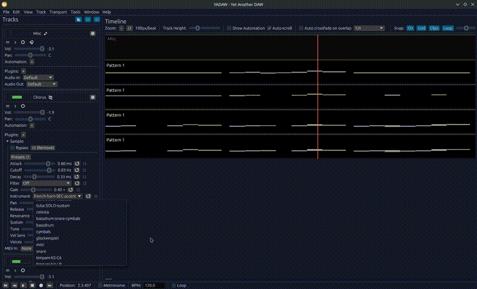

## Yadaw 

A basic daw for sound effects (works on Android too, but not as functional). Is also pretty lightweight (<20mb)

Current intention is to not add too much code for outdated parts, and to keep it minimal; helps refactoring later on, might implement a plugin system like blender if needed (for example, midi controller lanes feature could be implemented as a plugin, etc..)

### Build from source
#### Desktop
- Just run using `cargo run` for windows, mac or linux, and install any missing libs (mostly pkgconfig, lv2 headers & livi components, windows doesn't have a release build, and needs to be compiled manually for now, maybe donation only in future? Need some sort of revenue ig).
#### Android
- Follow the instructions in the third_party folder's md.
- Plugins should be compiled beforehand for android (tested vitsel-clap and works well on android)
- Hint: Saving and loading works by scrolling fully to the bottom and clicking on the last 4th (or 5th) entry (is a hack for now, will implement proper perms later; currently only works for certain internal folders)

#### Missing common features (would not be done in the near future)

- No VST support (LV2 and CLAP only).
- No MP3/FLAC export (WAV only).

### License 

[AGPL-3.0](https://www.gnu.org/licenses/agpl-3.0.en.html)
